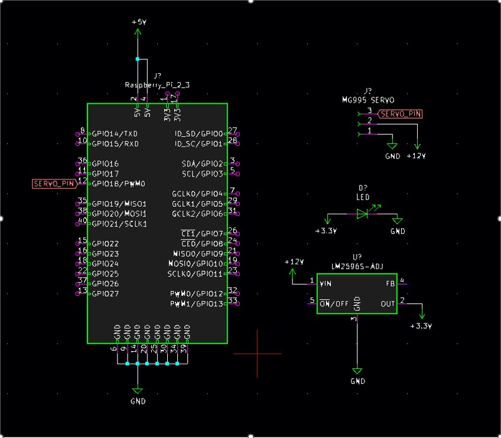

## Automatic Camera Focusing System
# Overview
This project involves the development of an automatic camera focusing system utilizing a combination of Raspberry Pi, OpenCV, Python, and a servo motor. The system automates the traditionally manual process of focus adjustment, providing real-time feedback and enabling precise focus for photography, surveillance, and computer vision applications.

# Objectives
1. Automated Focus Adjustment: Control the camera lens with a servo motor for precise, remote adjustments.
2. Image Processing with OpenCV: Use a delentropy-based algorithm to assess the clarity of images.
3. Real-Time Feedback: Provide immediate focus status and save images once focused.
4. Integration: Seamlessly combine components like Raspberry Pi, servo motor, and camera module.
5. Optimization: Evaluate and refine the system for improved accuracy and efficiency.
# Features
* Focus adjustment through a servo-controlled camera lens.
* Image sharpness analysis using delentropy metrics.
* Efficient and reliable operation in varying light conditions.
* Compact design with 3D-printed custom parts.
## Components
# Hardware
* Raspberry Pi v2: Central processing unit for system integration.
* MG995 Servo Motor: Adjusts the lens focus ring.
* Raspberry Pi HQ Camera Module: Captures high-resolution images.
* LM2596 Voltage Regulator: Provides stable power supply.
* Additional components: LED lamp, 12V power supply, trapezoidal lead screw, and 3D-printed mechanical parts.
# Software
* Raspbian OS: Operating system for Raspberry Pi.
* OpenCV Library: Image processing and analysis.
* PiGPIO Library: Optimized PWM signal generator for servo motor control.
# Installation and Setup
1. Install Raspbian OS on Raspberry Pi.
2. Install the OpenCV library:

<pre> sudo apt-get install python3-opencv </pre>

3. Install the PiGPIO library like described in the website:
<pre> https://abyz.me.uk/rpi/pigpio/download.html </pre>

4. Connect hardware components as per the circuit schematic.

5. Run the focus adjustment script:

<pre> python3 AutoFocus.py </pre>

# Usage
1. Power on the Raspberry Pi and connected components.
2. Adjust focus by pointing the camera at the target object.
3. The system will analyze the image's clarity and automatically adjust the focus.
# Applications
* Photography: Enhanced focus precision for capturing sharp images.
* Surveillance: Continuous focus adjustments for monitoring.
* Microscopy: Precise focus on specimens for detailed analysis.
* Robotics: Improved navigation through real-time focus adjustments.
# Challenges and Solutions
* Low processing power: Optimized algorithms to focus on specific image regions.
* Servo jitter: Resolved by switching to the PiGPIO library.
* Lighting issues: Incorporated LED lamp for better illumination.
# Future Improvements
* Enhancing focus adjustment speed.
* Reducing system size for compact applications.
* Extending use cases to include robotics and industrial automation.
